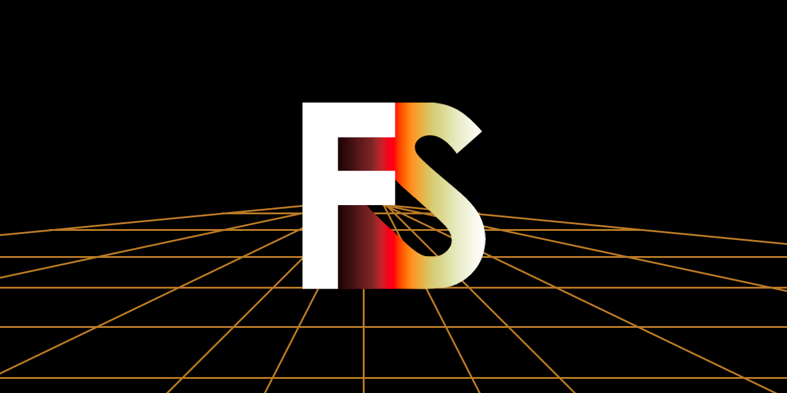

  
[](https://ci.appveyor.com/project/sanyaalabai/firesteel)
[](https://firesteel.readthedocs.io/ru/latest/?badge=latest)
[](http://doge.mit-license.org)  
[](https://discord.gg/jw6YSwTFrU)
[](https://t.me/xanytka)  
# Firesteel
Понятный, кроссплатформенный\* и полностью настраиваемый движок для создания игр и программ.

## Возмодности создания игр
На данный момент движок работает как програмный слой (имеет редактор с конфигурацией).
## Возмодности создания программ
На данный момент можно использовать лишь ImGUI, который включён в билд, но ведётся работа над нативной UI библиотекой (fs.ui).
## Пакетная система
Весь функционал движка поставляется через пакеты. Автоматически включаются только отрисовщик тестового GUI, загрузчики контента и мат. база. Дополнительно пакеты можно загружать с [сайта пакетов](https://xanytka.ru/p/).

# Политика публикации
Игры и программы можно свободно публиковать в любом интернет-магазине ([XGLauncher](https://github.com/xanytka-devs/xglauncher), [Steam](https://store.steampowered.com/), [Epic Games Store](https://store.epicgames.com/) и т.д.).
При издании физических копий игры/программы необходимо [сделать запрос к Xanytka](https://support.xanytka.ru/publisher/phys_copies).

# Сторонние библиотеки
* [Assimp](https://github.com/assimp/assimp)
* [Box2D](https://github.com/erincatto/box2d)
* [Bullet3](https://github.com/bulletphysics/bullet3.git)
* [GLM](https://github.com/g-truc/glm)
* [ImGUI](https://github.com/ocornut/imgui)
* [Nlohmann JSON](https://github.com/nlohmann/json)
* [STB](https://github.com/nothings/stb)

# Установка

## Упрощённая
* Запустите команду `git clone --recursive https://github.com/xanytka-devs/fs-example.git`
* Установите [CMake](https://cmake.org/)
* Запустите `auto_cmake.cmd`

## Обычная
* Запустите команду `git clone --recursive https://github.com/xanytka-devs/firesteel.git engine`
* Установите [CMake](https://cmake.org/)
* Создайте файл `main.cpp`, в котором вы будете писать код приложения
* Создайте файл `CMakeLists.txt` с содержимым:
```cmake
cmake_minimum_required(VERSION 3.12)
project(example)
add_subdirectory(engine)

add_executable(example
	"main.cpp"
)
target_link_libraries(example
	firesteel
	glad
	imgui
	glm
	assimp
	OpenAL
)
target_compile_features(example PUBLIC cxx_std_17)
target_include_directories(example PUBLIC includes)
target_include_directories(example PUBLIC engine/external/glfw)
set_target_properties(example PROPERTIES RUNTIME_OUTPUT_DIRECTORY ${CMAKE_BINARY_DIR}/bin/)
```
* Постройте проект через CMake
	* Создайте папку `build`
	* Откройте командую строку в этой новой папке и введите в неё `cmake ..`

> [!NOTE]
> Установка для Linux и MacOS ещё не продумана, но сильно отличаться не должна.
