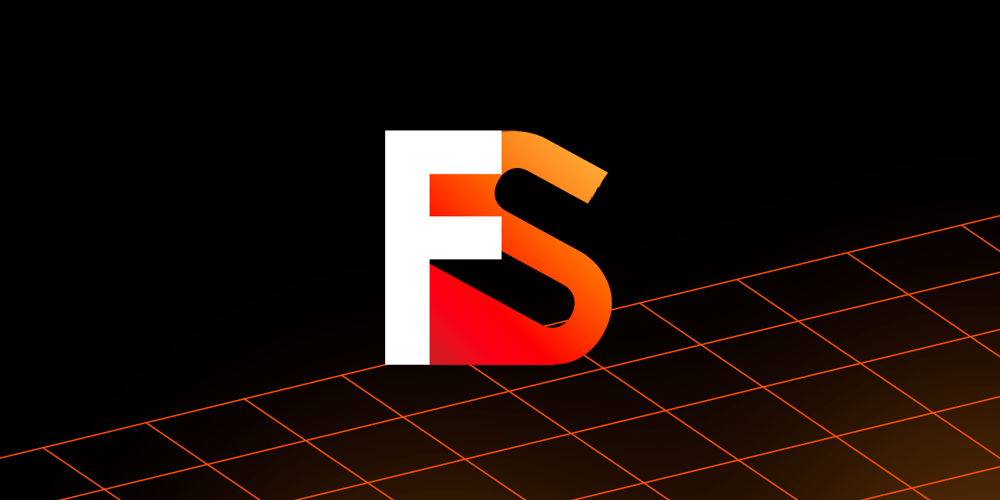

  
[](https://ci.appveyor.com/project/sanyaalabai/firesteel)
[](https://firesteel.readthedocs.io/ru/latest/?badge=latest)
[](http://doge.mit-license.org)
[](https://t.me/xanytka)  
# Firesteel
Понятный, кроссплатформенный\* и полностью настраиваемый программный слой для создания игр и программ.

## Возможности создания игр
Программный слой имеет лишь загрузчики контента, отрисовщик и математическую базу. Однако также имеется обширная библиотека [пакетов](https://xanytka.ru/p).
Если же вам необходимо более простое решение, то рекомендуется использование [FSE](https://xanytka.ru/shared/fse).

## Возможности создания программ
Программный слой использует ImGUI, который включён в билд, но ведётся работа над нативной UI библиотекой [fs.ui](https://xanytka.ru/p/search/?search=fs.ui&tags=&env=none).

## Пакетная система
Весь функционал движка поставляется через пакеты. Дополнительные пакеты можно загружать с [общего репозитория](https://xanytka.ru/p/).

# Политика публикации
Игры и программы можно свободно публиковать в любом интернет-магазине ([Steam](https://store.steampowered.com/), [Epic Games Store](https://store.epicgames.com/) и т.д.).
При издании физических копий игры/программы необходимо [сделать запрос к Xanytka](https://support.xanytka.ru/publisher/phys_copies).

# Сторонние библиотеки
## Изначально включены
* [GLM](https://github.com/g-truc/glm)
* [ImGUI](https://github.com/ocornut/imgui)
* [Nlohmann JSON](https://github.com/nlohmann/json)
* [STB Image Read/Write](https://github.com/nothings/stb)
* [Portable File Dialogs](https://github.com/samhocevar/portable-file-dialogs)
* [TinyGLTF](https://github.com/syoyo/tinygltf)
* [TinyOBJ Loader](https://github.com/tinyobjloader/tinyobjloader)
* [UFBX](https://github.com/ufbx/ufbx)
## Дополнительно доступны
Для доступа к ним измените [флаги в CMake](https://firesteel.readthedocs.io/ru/latest/flags/#cmake).
* [NVTX](https://github.com/NVIDIA/NVTX)
* [OpenFBX](https://github.com/nem0/OpenFBX)

# Использование

## Обычная (рекомендуется)
* Установите [Git](https://git-scm.com/) и [CMake](https://cmake.org/)
* Запустите команду
```bash
git submodule add --recursive https://github.com/xanytka-devs/firesteel.git engine
```
* Запустите `auto_cmake.cmd` внутри новой папки

## Упрощённая
Инструкции по сборке можно найти [тут](https://github.com/xanytka-devs/fs-example).

> [!NOTE]
> Установка и работа на Linux и MacOS ещё не реализованы, однако некоторые компоненты уже могут работать с Linux.

# Примеры
Все официальные примеры по использованию программного слоя можно найти [тут](https://github.com/xanytka-devs/fs-examples).
