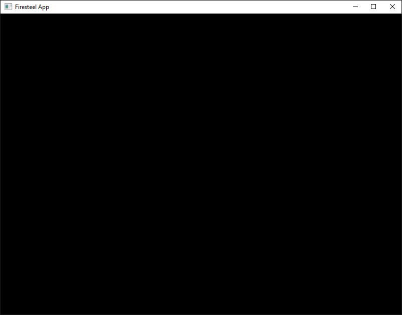

# Предисловие
Начнём с простого - "Hello World!" на **Firesteel**.

# Отрисовка окна
Для создания простого окна нужно добавить несколько простых строчек кода в файл **main.cpp**:
``` cpp
#include "engine/include/app.hpp"
using namespace Firesteel;

class HelloWorldApp : public Firesteel::App {
    virtual void onInitialize() override {
        LOG_INFO("Hello World!");
    }
};

int main() {
    return HelloWorldApp{}.start();
}
```
После постройки и запуска проекта у вас появится консоль, в которой где-то до `[STAT] UPDATE LOOP` будет `Hello World!`, а также окно:


# Объяснение
Все приложения и игры, созданные не Firesteel наследуют от класса **App**. Там есть базовые методы, такие как `onInitialize()` (срабатывает после инициализации всех библиотек), `onUpdate()` (запускается каждый тик/кадр) и `onShutdown()` (срабатывает при завершении работы приложения). А также `deltaTime` (разница между временем этого и предыдущего кадра) и `fps` (количество кадров в секунду).  
Функция `HelloWorldApp{}.start()` стартует само приложение и может ещё принимать название, размер и режим будущего окна приложения. Функция `LOG_INFO(...)` нужна для вывода текста в консоль.

# Заключение
Итоговый, кхм, *код* вы можете найти [вот тут](https://github.com/xanytka-devs/fs-examples/blob/main/Window/main.cpp).